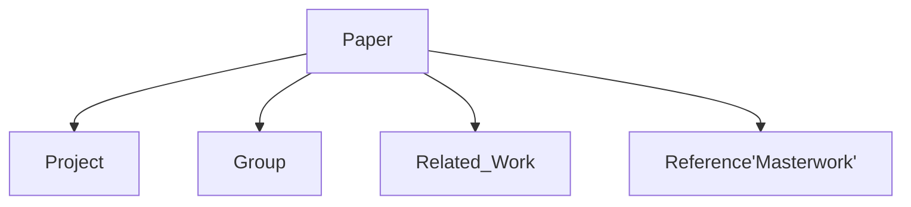

[toc]

## Abstract
* 主题: key-value store
* 调研方向:
	* 工业界项目
	* 学术界经典/最新论文及实现
	* 研究团队
	* 总结性文章

* 前沿方向涉及:
	* new algo/ds, eg: hash/lsm-tree/bitcask
	* new hardware, eg: Flash/NVMe/SSD/RDMA
	* distributed kv store
	* transaction on kv store

* 经典论文及前沿方向
	* 新硬件/技术based kv-store, 涉及NVM, FLASH, NUMA, RDMA...
	* 数据结构或算法based kv-store, 包括b-tree, lsm-tree, hash-func, hash-table等及其改进
	* 分布式kv-store, 关键词有consensus, paxos, replication等等, 按分布范围主要分为geo-distributed/datacenter
	* 事务性kv-store, 领域涵盖transaction, concurrency, recovery...
	* kv-store上建立索引index
	* kv-store cache系统
	* ...
* 以论文或项目为核心, 有如下调研路径(如下图):
	* Paper的创新点是?解决了什么问题?还有什么问题没解决?
	* Paper的相关或对比工作有?参考了哪些经典设计?
	* Paper的核心算法或数据结构是?
	* 是否有开源实现?Paper怎眼转化为代码?理论和实践的差异在哪里?
	* 背后的研究团队?追踪其最新方向和工作?

## conference
### Storage
* FAST
* HotStorage
* DSDE
* MSST

### Database
* Sigmod
* ICDE
* VLDB
* PODS
* CIDR
* ICDT

### Misc
* Usenix ATC
* OSDI
* SOSP
* NSDI
* SOCC
* HotOS

## Industry Project
* [Google/leveldb](https://github.com/google/leveldb)
> LevelDB is a fast key-value storage library written at Google that provides an ordered mapping from string keys to string values. 

* [Redis](https://github.com/antirez/redis)
> Redis is an in-memory database that persists on disk. The data model is key-value, but many different kind of values are supported: Strings, Lists, Sets, Sorted Sets, Hashes, HyperLogLogs, Bitmaps. http://redis.io

* [Boltdb](https://github.com/boltdb/bolt)
>An embedded key/value database for Go.

* [LMDB](https://symas.com/lmdb/)
	* [Github, lmdb](https://github.com/LMDB/lmdb)
	* [Wiki, lmdb](https://www.wikiwand.com/en/Lightning_Memory-Mapped_Database)

* [Facebook/rocksdb](https://github.com/facebook/rocksdb)
> A library that provides an embeddable, persistent key-value store for fast storage.

* [Memcached](https://memcached.org/)
	* [Github, memcached](https://github.com/memcached/memcached)
> Memcached is a high performance multithreaded event-based key/value cache store intended to be used in a distributed system.

* [FoundationDB](https://www.foundationdb.org)
	* [Github, foundationdb](https://github.com/apple/foundationdb)
> FoundationDB - the open source, distributed, transactional key-value store

* [Basho/Riak_kv](https://github.com/basho/riak_kv)
> Riak KV is an open source Erlang application that is distributed using the riak_core Erlang library. Riak KV provides a key/value datastore and features MapReduce, lightweight data relations, and several different client APIs.

* [Apache/accumulo](https://accumulo.apache.org/)
> Apache Accumulo is a highly scalable sorted, distributed key-value store based on Google's Bigtable.

* [Apache/Ignite](https://ignite.apache.org/)
> Ignite™ is a memory-centric distributed database, caching, and processing platform for transactional, analytical, and streaming workloads, delivering in-memory speeds at petabyte scale)

* [Ecache](http://www.ehcache.org)
> Ehcache is an open source, standards-based cache that boosts performance, offloads your database, and simplifies scalability. 

* [MemcachedDb](http://memcachedb.org/)
	* [Github,  "LMDB port of MemcacheDB".](https://github.com/LMDB/memcachedb)
	* [Wiki, MemCacheDB](https://www.wikiwand.com/en/MemcacheDB)

* [Tokyo Cabinet](http://fallabs.com/tokyocabinet/)
	* [Github, kyoto](https://github.com/alticelabs/kyoto)

* [Kyoto Tycoon](http://fallabs.com/kyototycoon/)
	* [Github, Tycoon](https://github.com/alticelabs/kyoto)

* [tikv](https://github.com/pingcap/tikv)
> Distributed transactional key value database powered by Rust and Raft https://pingcap.com

* [Linkedin/PalDB](https://github.com/linkedin/PalDB)
> An embeddable write-once key-value store written in Java

* [Yahoo/MDBM a very fast memory-mapped key/value store](https://github.com/yahoo/mdbm)

### Storage Library
* [WiredTiger](http://www.wiredtiger.com/)
	* [Github, WiredTiger](https://github.com/wiredtiger/wiredtiger)
	* [Developer Site](http://source.wiredtiger.com/)
> WiredTiger is an high performance, scalable, production quality, NoSQL, Open Source extensible platform for data management.
WiredTiger supports row-oriented storage (where all columns of a row are stored together), column-oriented storage (where columns are stored in groups, allowing for more efficient access and storage of column subsets) and log-structured merge trees (LSM), for sustained throughput under random insert workloads.
WiredTiger includes ACID transactions with standard isolation levels and durability at both checkpoint and fine-grained granularity.
WiredTiger can be used as a simple key/value store, but also has a complete schema layer, including indices and projections.
WiredTiger should be generally portable to any 64-bit system supporting the ANSI C99, POSIX 1003.1 and POSIX 1003.1c (threads extension) standards.

* [sophia](http://sophia.systems)
	* [Github, sophia](http://sophia.systems)
> Modern transactional key-value/row storage library. 

* [Spotify/sparkey](https://github.com/spotify/sparkey)
> Simple constant key/value storage library, for read-heavy systems with infrequent large bulk inserts.

* [Docker/libkv](https://github.com/docker/libkv)
> Distributed key/value store abstraction library

* [PerconaFT](http://www.percona.com/)
	* [Github, PreconaFT](https://github.com/percona/PerconaFT)
> PerconaFT is a high-performance, transactional key-value store, used in the TokuDB storage engine for Percona Server and MySQL, and in TokuMX, the high-performance MongoDB distribution.

* [ForestDb](https://github.com/couchbase/forestdb)
> A Fast Key-Value Storage Engine Based on Hierarchical B+-Tree Trie
ForestDB is a key-value storage engine developed by Couchbase Caching and Storage Team, and its main index structure is built from Hierarchical B+-Tree based Trie, called HB+-Trie. ForestDB paper has been published in IEEE Transactions on Computers.

## Academia Paper
### Academia Project
* [Amazon/Dynamo: Amazon's Highly Available Key-Value Store, SOSP07](http://www.allthingsdistributed.com/2007/10/amazons_dynamo.html)
* [Voldemort](https://github.com/voldemort/voldemort)
> An open source clone of Amazon's Dynamo. http://project-voldemort.com
* [Dynomite](https://github.com/Netflix/dynomite)
> A generic dynamo implementation for different k-v storage engines
* [Pynamo: Exploring the Dynamo Paper in Python](https://www.lurklurk.org/pynamo/pynamo.html)
* [Dynomite, 8yearago](https://github.com/moonpolysoft/dynomite)
> Open source dynamo clone written in Erlang.
* [Ringo](https://github.com/tuulos/ringo)
> Distributed key-value storage a'la Amazon Dynamo
---

* [Stanford/RAMCloud](https://ramcloud.stanford.edu)
	* [Github](https://github.com/PlatformLab/RAMCloud)
> distributed key-value storage on DRAM, with strong consensus, low lantency, durability...
Research Project with many paper(Raft, Silk, RamCloud, etc.)

* [SLIK: Scalable Low-Latency Indexes for a Key-Value Store, ATC16](https://www.usenix.org/conference/atc16/technical-sessions/presentation/kejriwal)
[phd thesis](https://web.stanford.edu/~ouster/cgi-bin/papers/KejriwalPhd.pdf)
---

* [CMU/FAWN](http://www.cs.cmu.edu/~fawnproj/)
	* [Github: FAWN-KV](https://github.com/vrv/FAWN-KV)
---

* [HyperDex](http://hyperdex.org)
	* [Github, HyperDex](https://github.com/rescrv/HyperDex)
	* [Paper, HyperDex: A Distributed, Searchable Key-Value Store sigcomm12](http://rescrv.net/papers/hyperdex-sigcomm12.pdf)
	* [Paper, HyperDex Warp: Lightweight Multi-Key Transactions for Key-Value Stores](https://arxiv.org/pdf/1509.07815)
> HyperDex is a scalable, searchable key-value store 

* [Consus is a geo-replicated transactional key-value store](http://consus.io/)
	* [Github, consus](https://github.com/rescrv/Consus)
	* [Paper, Consus: Taming the Paxi, arxiv16](https://arxiv.org/abs/1612.03457)
---

* [Princeton/CRAQ](http://sns.cs.princeton.edu/projects/craq/)
 	* [Paper, CRAQ: Strongly-consistent K-V storage using chain-replication, ATC09](http://sns.cs.princeton.edu/docs/craq-usenix09.pdf)
	* [Github, craq](https://github.com/jterrace/craq)
---

* [Apache/Cassandra](https://apache.cassandra.org)
---

### Cache
* [DIDACache: A Deep Integration of Device and Application for Flash Based Key-Value Caching, FAST2017](https://www.usenix.org/conference/fast17/technical-sessions/presentation/shen)

* [Memshare: a Dynamic Multi-tenant Key-value Cache, ATC2017](https://www.usenix.org/conference/atc17/technical-sessions/presentation/cidon)

* [LAMA: Optimized Locality-aware Memory Allocation for Key-value Cache, ATC15](https://www.usenix.org/conference/atc15/technical-session/presentation/hu)

* [NetCache: Balancing Key-Value Stores with Fast In-Network Caching, SOSP17](http://sigops.org/sosp/sosp17/program.html)

### DS & Algo
#### radix tree
* [WORT: Write Optimal Radix Tree for Persistent Memory Storage Systems, FAST2017](https://www.usenix.org/conference/fast17/technical-sessions/presentation/lee-se-kwon)
---

* [A Comprehensive Performance Evaluation of Modern in-Memory Indices, ICDE18](http://www.comp.nus.edu.sg/~dbsystem/download/xie-icde18-paper.pdf)
---

* [The adaptive radix tree: ARTful indexing for main-memory databases, ICDE13](http://ieeexplore.ieee.org/abstract/document/6544812/)

#### lsm-tree
### table-store
* [Google/Bigtable]
* [kdi](https://github.com/bluefish/kdi)
> Distributed structured data interface inspired by Google's BigTable

* [TRIAD: Creating Synergies Between Memory, Disk and Log in Log Structured Key-Value Stores, ATC17](https://www.usenix.org/conference/atc17/technical-sessions/presentation/balmau)
	* [Github](https://github.com/epfl-labos/TRIAD)
---

* [Towards Accurate and Fast Evaluation of Multi-Stage Log-structured Designs, FAST2016](https://www.usenix.org/conference/fast16/technical-sessions/presentation/lim)
	* [Github, msls-eval](https://github.com/efficient/msls-eval)
---

* [ElasticBF: Fine-grained and Elastic Bloom Filter Towards Efficient Read for LSM-tree-based KV Stores, HotStorage18](https://www.usenix.org/conference/hotstorage18/presentation/zhang)
---
* [LSM-trie: An LSM-tree-based Ultra-Large Key-Value Store for Small Data Items](https://www.usenix.org/conference/atc15/technical-session/presentation/wu)
	* [Github](https://github.com/wuxb45/lsm-trie)

---

* [USTA/PebblesDB: Building Key-Value Stores using Fragmented Log-Structured Merge Trees](http://sigops.org/sosp/sosp17/program.html)
	* [Github, PebblesDb](https://github.com/utsaslab/pebblesdb)
---

* [bLSM: a general purpose log structured merge tree, Sigmod12](https://dl.acm.org/citation.cfm?id=2213862)

#### erasure code
* [Cocylus: Efficient and Available In-memory KV-Store with Hybrid Erasure Coding and Replication, FAST2016](https://www.usenix.org/conference/fast16/technical-sessions/presentation/zhang-heng)
	* [Github](https://github.com/SJTU-IPADS/cocytus)

#### hash
* [SmartCuckoo: A Fast and Cost-Efficient Hashing Index Scheme for Cloud Storage Systems, ATC17](https://www.usenix.org/conference/atc17/technical-sessions/presentation/sun)
---

* [CMU/MemC3: Compact and Concurrent MemCache with Dumber Caching and Smarter Hashing, NSDI13](https://www.usenix.org/conference/nsdi13/technical-sessions/presentation/fan)
	* [Github. memc3](https://github.com/efficient/memc3)
---

* [Resizable, Scalable, Concurrent Hash Tables via Relativistic Programming](https://www.usenix.org/legacy/events/atc11/tech/final_files/Triplett.pdf)

#### b-tree
* [Stratified B-trees and Versioned Dictionaries](https://www.usenix.org/legacy/events/hotstorage11/tech/tech.html#Twigg)
---

* [The Bw-Tree: A B-tree for new hardware platforms, ICDE13](http://ieeexplore.ieee.org/abstract/document/6544834/)

#### b+-tree
* [Endurable Transient Inconsistency in Byte-Addressable Persistent B+-Tree, FAST2018](https://www.usenix.org/conference/fast18/presentation/hwang)

* [Resolving Journaling of Journal Anomaly in Android I/O: Multi-Version B-tree with Lazy Split, FAST14](https://www.usenix.org/conference/fast14/technical-sessions/presentation/kim-wook-hee)

#### masstree
* [Cache Craftiness for Fast Multicore Key-Value Storage, EUROSYS12](https://pdos.csail.mit.edu/papers/masstree:eurosys12.pdf)
	* [Github, masstree](https://github.com/kohler/masstree-beta)
	* [Github, masstree](https://github.com/rmind/masstree)

### New H/W
#### NVM
* [NV-Tree: Reducing Consistency Cost for NVM-based Single Level Systems, FAST2015](https://www.usenix.org/conference/fast15/technical-sessions/presentation/yang)

* [Non-volatile Memory through Customized Key-value Stores, HotStorage16](https://www.usenix.org/conference/hotstorage16/workshop-program/presentation/marmol)

* [HiKV: A Hybrid Index Key-Value Store for DRAM-NVM Memory Systems, ATC17](https://www.usenix.org/conference/atc17/technical-sessions/presentation/xia)

* [NVMKV: A Scalable, Lightweight, FTL-aware Key-Value Store, ATC15](https://www.usenix.org/conference/atc15/technical-session/presentation/marmol)
	* [Github, nvmkv](https://github.com/opennvm/nvmkv)
  
* [Consistent and Durable Data Structures for Non-Volatile Byte-Addressable Memory, FAST11](https://www.usenix.org/conference/fast11/consistent-and-durable-data-structures-non-volatile-byte-addressable-memory)

#### RDMA
* [CMU/HERD: Using RDMA Efficiently for Key-Value Services](https://www.cs.cmu.edu/~akalia/doc/sigcomm14/herd_readable.pdf)
	* [Github](https://github.com/efficient/HERD)
---

* [Design Guidelines for High Performance RDMA Systems](https://www.usenix.org/conference/atc16/technical-sessions/presentation/kalia)
	* [Github, CMU/rdma-bench](https://github.com/efficient/rdma_bench)

* [Palif: Using One-Sided RDMA Reads to Build a Fast, CPU-Efficient Key-Value Store, ATC13](https://www.usenix.org/conference/atc13/technical-sessions/presentation/mitchell)
	* [Project, Pilaf](http://ns3.fs.net/projects/pilaf/)
---

* [FaSST: Fast, Scalable and Simple Distributed Transactions with Two-Sided (RDMA) Datagram RPCs](https://www.usenix.org/conference/osdi16/technical-sessions/presentation/kalia)
	* [Github, fasst](https://github.com/efficient/fasst)
---

* [FaRM: Fast Remote Memory, NSDI14](https://www.usenix.org/conference/nsdi14/technical-sessions/dragojevi%C4%87)

#### NIC
* [KV-Direct: High-Performance In-Memory Key-Value Store with Programmable NIC](http://sigops.org/sosp/sosp17/program.html)

#### Flash
* [Optimizing Flash-based Key-value Cache Systems, HotStorage16](https://www.usenix.org/conference/hotstorage16/workshop-program/presentation/shen)
---

* [CMU/SILT: A Memory-Efficient, High-Performance Key-Value Store](http://www.sigops.org/sosp/sosp11/current/index.html#01-lim)
	* [Github, silt](https://github.com/silt/silt)
---

* [CORFU: A Shared Log Design for Flash Clusters, NSDI12](https://www.usenix.org/conference/nsdi12/technical-sessions/presentation/balakrishnan)
---

* [SkimpyStash: RAM space skimpy key-value store on flash-based storage, Sigmod13](https://dl.acm.org/citation.cfm?id=1989327)

#### HPC
* [MDHIM: A Parallel Key/Value Framework for HPC](https://www.usenix.org/conference/hotstorage15/workshop-program/presentation/greenberg)
	* [Github, BurstFs](https://github.com/LLNL/burstfs/tree/master/BurstFS_Meta)

#### multi-core
* [CMU/MICA: A Holistic Approach to Fast In-Memory Key-Value Storage, NSDI14](https://www.usenix.org/node/179748)
	* [Github, mica](https://github.com/efficient/mica)
	* [Github, mica2](https://github.com/efficient/mica2)

* [Fackbook/Tilera: Many-Core Key-Value Store, IEEE11](https://www.cs.princeton.edu/courses/archive/spring13/cos598C/facebook-tilera-whitepaper.pdf)

#### GPU
* [MemcachedGPU: Scaling-up Scale-out Key-value Stores, socc15](http://ece.ubc.ca/~taylerh/doc/MemcachedGPU_SoCC15.pdf)
	* [Github, MemcacheGPU](https://github.com/tayler-hetherington/MemcachedGPU)

#### persist memory
* [Persistent Memcached: Bringing Legacy Code to Byte-Addressable Persistent Memory, HotStorage17](https://www.usenix.org/conference/hotstorage17/program/presentation/marathe)

### R&D
* [WiscKey, FAST16](https://www.usenix.org/conference/fast16/technical-sessions/presentation/lu)
* [WiscKey](https://github.com/joker-qi/WiscKey)
> WiscKey启发于FAST会议发表了论文 WiscKey: Separating Keys from Valuesin SSD-conscious Storage.WiscKey是基于leveldb 1.20版本进行修改的，WiscKey并不是按照论文里的设计来实现的，只是借鉴了kv分离的思想
* [Badger](https://github.com/dgraph-io/badger)
> BadgerDB is an embeddable, persistent, simple and fast key-value (KV) database written in pure Go. 
> Badger’s design is based on a paper titled WiscKey: Separating Keys from Values in SSD-conscious Storage.

* [Tucana: Design and Implementation of a Fast and Efficient Scale-up Key-value Store](https://www.usenix.org/conference/atc16/technical-sessions/presentation/papagiannis)
> reduce CPU overhead
---

* [Stout: An Adaptive Interface to Scalable Cloud Storage, ATC10](https://www.usenix.org/legacy/events/atc10/tech/#McCullough)

* [ZooKeeper: Wait-free Coordination for Internet-scale Systems, ATC!)](https://www.usenix.org/legacy/events/atc10/tech/)

* [Modular Data Storage with Anvil, SOSP09](http://www.sigops.org/sosp/sosp09/program.html#session4)
	* [Git, anvil](http://www.crystalorb.net/mikem/ucla/anvil/)

### Transaction
* [The SNOW Theorem and Latency-Optimal Read-Only Transactions, OSDI16](https://www.usenix.org/conference/osdi16/technical-sessions/presentation/lu)
	* [Github,SNOW-COPS](https://github.com/USC-NSL/COPS-SNOW)
	* [Github, Rococo-SNOW](https://github.com/USC-NSL/Rococo-SNOW)
---

* [Extracting More Concurrency from Distributed Transactions, OSDI14](https://www.usenix.org/conference/osdi14/technical-sessions/presentation/mu)
	* [Github: rococo](https://github.com/msmummy/rococo)
	* [Intro: rococo](http://www.cs.princeton.edu/~wlloyd/research.html#rococo)
---

* [Consolidating Concurrency Control and Consensus
for Commits under Conflicts with Janus, OSDI16](http://www.cs.princeton.edu/~wlloyd/research.html#janus)
	* [Github, janus](https://github.com/NYU-NEWS/janus)
---

* [UW/TAPIR: Building Consistent Transactions with Inconsistent Replication, SOSP15](http://sigops.org/sosp/sosp15/current/index.html#048-zhang)
	* [Github, tapir](https://github.com/UWSysLab/tapir)
---
* [UW/Eris: Coordination-Free Consistent Transactions Using In-Network Concurrency Control, SOSP17](http://sigops.org/sosp/sosp17/program.html)
	* [Github, Eris](https://github.com/UWSysLab/Eris)
---

* [Github, MVTX: modular multi-version transactional key-value storage system](https://github.com/mkaguilera/mvtx)
----

* [Omid, Reloaded: Scalable and Highly-Available Transaction Processing, FAST2017](https://www.usenix.org/conference/fast17/technical-sessions/presentation/shacham)
> Omid—a transaction processing service that powers web-scale production systems at Yahoo. Omid provides ACID transaction semantics on top of traditional key-value storage; its implementation over Apache HBase is open sourced as part of Apache Incubator.
---

* [G-Store: A Scalable Data Store for Transactional Multi key Access in the Cloud, socc11](http://www.cs.ucsb.edu/~sudipto/papers/socc10-das.pdf)
	[UCSB/G-Store](http://www.cs.ucsb.edu/~dsl/?q=gstore)
---

### Distributed
#### geo
* [Comet: An Active Distributed Key-Value Store, OSDI10](https://www.usenix.org/legacy/events/osdi10/tech/tech.html#Geambasu)
	* [Github, comet](https://github.com/alevy/comet)
---

* [Stronger Semantics for Low-Latency Geo-Replicated Storage, NSDI2013](http://www.cs.princeton.edu/~wlloyd/research.html#eiger) 
	* [Github, eiger](http://github.com/wlloyd/eiger)
---

* [Transactional storage for geo-replicated systems, SOSP11](http://www.sigops.org/sosp/sosp11/current/index.html#27-sovran)
	* [Projec, Walter](http://geo.news.cs.nyu.edu/)
	
* [Transaction Chains: Achieving Serializability with Low Latency in Geo-Distributed Storage Systems](http://news.cs.nyu.edu/~jinyang/pub/sosp13-lynx.pdf)
	* [Project, Lynx](http://geo.news.cs.nyu.edu/)
---

* [SPANStore: Cost-Effective Geo-Replicated Storage Spanning Multiple Cloud Services, SOSP13](http://sigops.org/sosp/sosp13/program.html)
---

* [A Self-Configurable Geo-Replicated Cloud Storage Systemm, OSDI14](https://www.usenix.org/conference/osdi14/technical-sessions/presentation/ardekani)
---

* [Online migration for geo-distributed storage systems](https://www.usenix.org/legacy/events/atc11/tech/final_files/Tran.pdf)
---

* [UCB/Anna: A KVS For Any Scale, ICDE18](https://rise.cs.berkeley.edu/blog/anna-kvs/)
	* [Github, anna](https://github.com/cw75/anna)
	* [Paper, Anna](http://db.cs.berkeley.edu/jmh/papers/anna_ieee18.pdf)
	* [Intro](https://cloud.tencent.com/developer/news/196252)
---

* [Scalaris](http://scalaris.zib.de/)
	* [Github, Scalaris, Erlang](https://github.com/scalaris-team/scalaris)
	> Scalaris is a scalable, transactional, distributed and fault-tolerant key-value-store with strong data consistency for online databases and Web 2.0 services.
---

* [On the Efficiency of Durable State Machine Replication, atc13](https://www.usenix.org/conference/atc13/technical-sessions/presentation/bessani)
	* [Github](https://github.com/bft-smart/library)

---

#### cloud
* [Hybris: robust and strongly consistent hybrid cloud storage, socc14](http://www.eurecom.fr/en/publication/4414/detail/hybris-robust-hybrid-cloud-storage)
	* [Github, hybirs](https://github.com/pviotti/hybris)
---

* [Robust Data Sharing with Key-Value Stores](http://webee.technion.ac.il/people/ittay/publications/icDSN12.pdf)

#### consistency
* [Don’t Settle for Eventual: Scalable Causal Consistency for Wide-Area Storage with COPS, SOSP11](http://www.sigops.org/sosp/sosp11/current/index.html#28-lloyd)
	* [Projec, COPS](http://sns.cs.princeton.edu/projects/cops-and-eiger/)
---

* [UW/Scalable Consistency in Scatter, SOSP11](http://www.sigops.org/sosp/sosp11/current/index.html#02-glendenning)
---

* [Consistency-based service level agreements for cloud storage, SOSP13](https://dl.acm.org/citation.cfm?doid=2517349.2522731)
> Pileus is a replicated key-value store that allows applications to declare their consistency and latency priorities via consistency-based service level agreements (SLAs)
---

### Mics
* [Correlated Crash Vulnerabilities, OSDI16](https://www.usenix.org/conference/osdi16/technical-sessions/presentation/alagappan)

* [Workload Analysis of a Large-Scale Key-Value Store ,SIGMETRICS'12](http://ranger.uta.edu/~sjiang/pubs/papers/atikoglu12-memcached.pdf)

* [Concerto: A High Concurrency Key-Value Store with Integrity](https://dl.acm.org/citation.cfm?doid=3035918.3064030)

### Blockchain-related
* [BlockStack](https://blockstack.org/)
	* [Paper, Experiences with Scaling Blockchain-based Data Stores](https://www.usenix.org/conference/atc15/technical-session/presentation/ali)
	* [Github, blockstack](https://github.com/blockstack)

### Test & Benchmark
* [Yahoo/YCSB, socc11](https://github.com/brianfrankcooper/YCSB/wiki/Papers-and-Presentations)
	* [Github, ycsb](https://github.com/brianfrankcooper/YCSB/)
---

* [CMU/YCSB++: Benchmarking and Performance Debugging Advanced Features in Scalable Table Stores](https://www.cs.cmu.edu/~kair/papers/ycsb++.pdf)
	* [Project, ycsb++](http://www.pdl.cmu.edu/ycsb++/)
---

* [KVZone and the Search for a Write-Optimized Key-Value Store, HotStorage10](https://www.usenix.org/legacy/events/hotstorage10/tech/full_papers/Gokhale.pdf)
	* [Github, kvzone](https://github.com/nitinaa/KVZone)
---

* [UW/Transtorm: a benchmark suite for transactional key value storage systems](https://homes.cs.washington.edu/~naveenks/files/2015_Transtorm_Poster.pdf)
---

* [Paper, Big Data Benchmarking](https://www.cs.helsinki.fi/u/jilu/paper/Khan.pdf)

## List
* [DB-Engines: key-value store](https://db-engines.com/en/ranking/key-value+store)

* [Nosql Database](http://nosql-database.org/)

* [Paper list, USC CSCI550 Advanced Data Store2014](https://web-app.usc.edu/soc/syllabus/20141/30000.pdf)

* [Githug Topic: key-value](https://github.com/topics/key-value)

* [Key value store](https://github.com/dterei/Research-Papers/tree/master/Key-Value%20Stores)

* [Awesome dbdev](https://github.com/huachaohuang/awesome-dbdev)

* [Stackoverflow, Alternatives for BerkeleyDB](https://stackoverflow.com/questions/260804/alternative-to-berkeleydb)

* [Anti-RDBMS: A list of distributed key-value stores
, 2009](https://www.metabrew.com/article/anti-rdbms-a-list-of-distributed-key-value-stores)

* [Paper, Comparative Survey of NoSQL/ NewSQL DB Systems](https://www.openu.ac.il/lists/mediaserver_documents/academic/cs/ComparativeSurvey.pdf)

* [Paper, Scalable SQL and NoSQL data stores, 2011Sigmod](https://dl.acm.org/citation.cfm?id=1978919)

* [paper, nosql-survey](https://www.baqend.com/files/nosql-survey.pdf)

* [Findbestopensource.com: key-value-store](https://www.findbestopensource.com/tagged/key-value-store)

* [Blog: a-deep-dive-into-nosql-a-complete-list-of-nosql-databases/](http://bigdata-madesimple.com/a-deep-dive-into-nosql-a-complete-list-of-nosql-databases/)

* [Review on HDD-Based, SSD-Based and Hybrid Key-Value Stores, IEEE2017](https://ieeexplore.ieee.org/document/8328542/)

## Key-value store explained
* [Wiki, key-value store](https://www.wikiwand.com/en/Key-value_database)

* [Basho, key-value-databases](http://basho.com/resources/key-value-databases/)

* [Paper, Key Value Stores: A Practical Overview, 2009](http://blog.marc-seeger.de/2009/09/21/key-value-stores-a-practical-overview/)

* [dbpedias[Gone] Survey of Distributed Databases](https://web.archive.org/web/20130302230223/https://dbpedias.com/wiki/NoSQL:Survey_of_Distributed_Databases)

## less-related
### shared-log
* [CorfuDB](https://github.com/CorfuDB/CorfuDB)
> Corfu is a consistency platform designed around the abstraction of a shared log. CorfuDB objects are in-memory, highly available data structures providing linearizable read/write operations and strictly serializable transactions. CorfuDB is based on peer-reviewed research, see References.
---

* [Tango: distributed data structures over a shared log, SOSP15](https://dl.acm.org/citation.cfm?doid=2517349.2522732)
	* [Github, zlog](https://github.com/cruzdb/zlog)
	* [Github, tangohs](https://github.com/derekelkins/tangohs)
	* [YC discuss](https://news.ycombinator.com/item?id=12944290)
---

### not related
* [The Full Path to Full-Path Indeding, FAST2018](https://www.usenix.org/conference/fast18/presentation/zhan)

* [Isotope: Transactional Isolation for Block Storage, FAST2016](https://www.usenix.org/conference/fast16/technical-sessions/presentation/shin)

